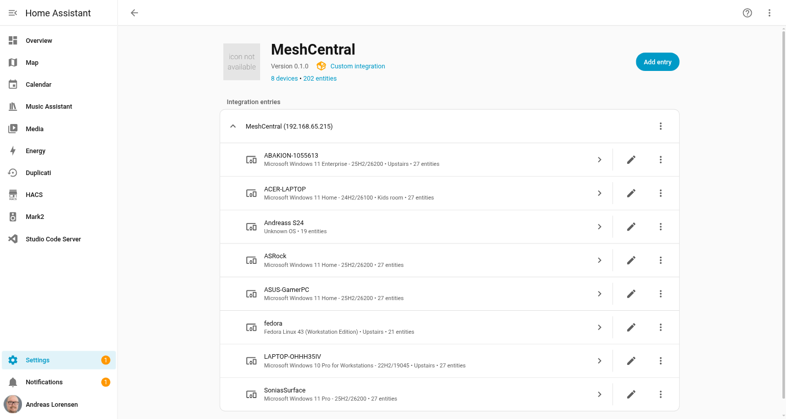
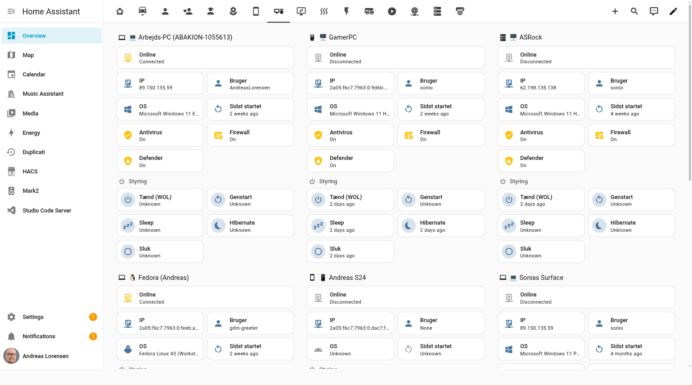

# ha-meshcentral

[](https://github.com/hacs/integration)[](https://github.com/andlo/ha-meshcentral/releases)

Home Assistant custom integration for [MeshCentral](https://meshcentral.com) — the open-source remote management platform.



## What is MeshCentral?

MeshCentral is a free, open-source remote device management platform you can self-host on your own server. It lets you remotely monitor, manage and control computers and devices — Windows, Linux, and macOS — from a single web interface. Think of it as your own private TeamViewer or AnyDesk, without subscriptions or cloud dependency.
### Why MeshCentral + Home Assistant?

Running MeshCentral alongside Home Assistant is a powerful combination for anyone who wants full control over their home network:

- **See all your devices in one place** — PC online/offline status, OS info, last boot time, and logged-in users appear as native HA entities alongside your lights, sensors, and other smart home devices.
- **Automate around your computers** — trigger automations when a PC comes online (start casting music, turn on the desk lamp), or when it goes offline (cut power to peripherals via a smart plug).
- **Power control from HA** — wake, reboot, sleep, hibernate or shut down any managed device via HA buttons or automations. Wake-on-LAN works even across subnets since MeshCentral relays the magic packet through its agents.
- **Security monitoring** — Windows Defender, firewall and antivirus status exposed as binary sensors. Get notified if real-time protection goes offline.
- **Hardware insight** — CPU, GPU, RAM, disk usage and more available as optional sensors, updated every 5 minutes.
- **Real-time push** — the integration uses MeshCentral's WebSocket API for instant online/offline updates, not slow polling.



## Features

### Per device — Status sensors

EntityDescription`binary_sensor.<n>_online`Agent connectivity (online/offline) — real-time`sensor.<n>_os`OS description`sensor.<n>_ip_address`Last known IP address`sensor.<n>_last_boot`Last boot time (timestamp)`sensor.<n>_idle_time`User idle time in seconds`sensor.<n>_active_users`Currently logged-in users`sensor.<n>_description`Device description from MeshCentral`sensor.<n>_agent_last_seen`When agent last contacted server`device_tracker.<n>_tracker`Home/not_home based on agent connectivity

### Per device — Security (Windows only)

EntityDescription`binary_sensor.<n>_antivirus_ok`Antivirus status`binary_sensor.<n>_firewall_ok`Firewall status`binary_sensor.<n>_defender_real_time_protection`Windows Defender real-time protection

### Per device — Power control

EntityDescription`button.<n>_reboot`Reboot device`button.<n>_shutdown`Shut down device`button.<n>_sleep`Sleep (Windows only)`button.<n>_hibernate`Hibernate (Windows only)`button.<n>_wake_on_lan`Wake-on-LAN via MeshCentral agents

**Wake-on-LAN** works even without direct network access — MeshCentral automatically finds online agents on the same network and uses them to broadcast the magic packet.

### Per device — Hardware detail sensors (disabled by default)

These sensors are fetched every 5 minutes via a separate `getsysinfo` call. They are **disabled by default** — enable them individually under Settings → Devices & Services → MeshCentral → device → Entities.

**All platforms:**

EntityDescription`sensor.<n>_cpu`CPU model name`sensor.<n>_gpu`GPU model name`sensor.<n>_bios_version`BIOS version (vendor + date as attributes)`sensor.<n>_motherboard`Motherboard model (vendor as attribute)

**Windows only:**

EntityDescription`sensor.<n>_ram_total`Total RAM in GB`sensor.<n>_disk_c_total`C: drive total size in GB`sensor.<n>_disk_c_free`C: drive free space in GB`sensor.<n>_disk_c_free_percent`C: drive free space in %`sensor.<n>_running_processes`Number of running processes`sensor.<n>_screen_resolution`Current screen resolution (e.g. 1920x1080)

**Linux only:**

EntityDescription`sensor.<n>_disk_used`Root filesystem used in MB`sensor.<n>_disk_free`Root filesystem free in MB

### Service

ServiceDescription`meshcentral.run_command`Run a shell command on any online device

## Installation

### Via HACS (recommended)

1. Open HACS → Integrations → ⋮ → Custom repositories
2. Add `https://github.com/andlo/ha-meshcentral` — category: Integration
3. Install **MeshCentral** and restart Home Assistant

### Manual

Copy `custom_components/meshcentral/` into your HA `custom_components/` directory and restart.

## Lovelace card

A custom card is included in the `www/` folder. Add it as a resource and use it in your dashboards.

**Add as resource** — Settings → Dashboards → Resources → Add resource:

- URL: `/local/meshcentral-card.js`
- Type: JavaScript module

**Copy the card file to HA:**

```bash
cp www/meshcentral-card.js /config/www/
```

**Card configuration:**

```yaml
type: custom:meshcentral-card
title: My Computers
devices:
  - fedora
  - ASUS-GamerPC
  - ASRock
```

The card shows online/offline status, OS, IP, logged-in users, last boot, security badges, and hardware info (CPU, RAM, disk) for each device — if the hardware sensors are enabled.

## Configuration

Go to **Settings → Devices & Services → Add Integration → MeshCentral** and enter:

FieldDescriptionHostIP or hostname of your MeshCentral serverPortDefault: 443UsernameMeshCentral usernamePasswordMeshCentral passwordUse SSLEnable for HTTPS/WSS (default: off)Verify SSLDisable if using self-signed cert (default: off)

### 2FA accounts

If your account has two-factor authentication enabled, create a **Login Token** in MeshCentral → My Account → Login Tokens. Use the generated username (`~t:...`) and password as credentials in HA — this bypasses 2FA entirely.

### TLS offload / reverse proxy

If MeshCentral runs behind a reverse proxy (Nginx, Cloudflare Tunnel) with `tlsOffload: true`, set **Use SSL = off** and point directly at the internal plain HTTP port — even if that port is 443. The server accepts plain HTTP/WS on that port while the proxy handles TLS externally.

## How it works

The integration uses two mechanisms in parallel:

- **Real-time WebSocket push** — a persistent connection to MeshCentral's `/control.ashx` endpoint receives `nodeconnect` events the moment a device goes online or offline. Online/offline status updates are instant.
- **Polling fallback** — a full device list refresh runs every 5 minutes to ensure nothing is missed if the WebSocket drops an event.
- **Hardware data** — a separate `getsysinfo` call runs every 5 minutes for each online device to update the hardware detail sensors.

## Automation examples

```yaml
# Turn on desk lamp when PC comes online
automation:
  trigger:
    platform: state
    entity_id: binary_sensor.fedora_online
    to: "on"
  action:
    service: light.turn_on
    target:
      entity_id: light.desk_lamp

# Alert if Windows Defender is disabled
automation:
  trigger:
    platform: state
    entity_id: binary_sensor.asus_gamerpc_defender_real_time_protection
    to: "off"
  action:
    service: notify.mobile_app
```

data: message: "⚠️ Windows Defender disabled on ASUS-GamerPC!"

```

# Run a command on a device

service: meshcentral.run_command data: device_id: fedora command: "systemctl restart nginx"
```

## Related

- [MeshCentral Add-on](https://github.com/andlo/ha-meshcentral-addon) — Run MeshCentral as a Home Assistant add-on (no separate server needed)
- [MeshCentral](https://meshcentral.com) — Official MeshCentral website
- [MeshCentral GitHub](https://github.com/Ylianst/MeshCentral) — MeshCentral source code

## License

MIT

```
```

```
```

```
```

```
```

```
```

```
```

```
```

```
```
